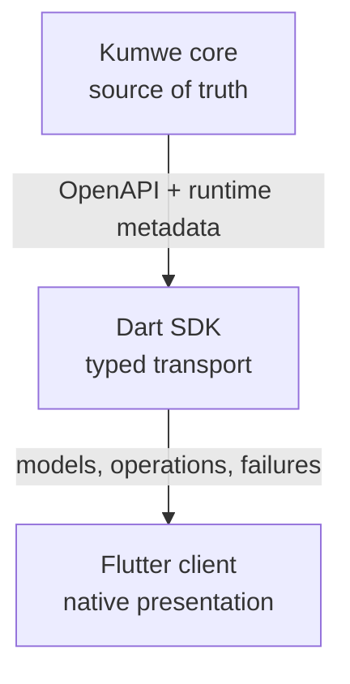

# Architecture

## Decision summary

Kumwe native client will use a strict three-layer ownership boundary:

The SDK is the only client HTTP boundary. Every surface inside the application is Flutter-native and API-backed. A missing native contract blocks that client journey; server-rendered HTML is not embedded as a fallback.

This decision is recorded in [ADR-0001](architecture/decisions/0001-core-api-dart-sdk-flutter-boundary.md).

## Responsibilities

### Kumwe core

Core owns and enforces:

- authoritative CMS content, business records, relations, files, settings, definitions, and lifecycle state;
- authentication, authorization, site/organization/workspace context, step-up, delegation, and non-enumeration;
- validation, exact-value rules, workflow, approval, concurrency, idempotency, transactions, revisions, and audit;
- query bounds, pagination, filtering, sorting, projections, reports, exports, jobs, and operation status;
- extension package trust, contribution ownership, runtime generation, activation/disable/revocation, and recovery behavior;
- server-rendered public, administrator, and portal web presentation; and
- canonical machine contracts, capability discovery, compatibility rules, and stable errors.

If a decision affects what data may exist, who may see or change it, or whether a mutation is valid, it belongs in core.

### Dart SDK

The separate [`kumwe/dart-sdk`](https://github.com/kumwe/dart-sdk) foundation owns transport mechanics:

- generated request/response DTOs and operation signatures from canonical OpenAPI;
- JSON serialization that preserves nullability, discriminators, exact decimal strings, money/quantity objects, timestamps, opaque cursors, and unknown-enum policy;
- base URL and exact site context; authorization header injection through an abstract credential provider;
- idempotency-key creation/persistence hooks and replay response recognition;
- ETag capture and `If-Match` requirements;
- RFC Problem Details decoding, correlation IDs, `Retry-After`, cancellation, timeouts, and safe retry classification;
- runtime contract/generation and capability discovery;
- upload/download streaming and integrity metadata when core defines them; and
- deterministic conformance fixtures against supported core revisions.

The SDK must expose enough protocol detail for a caller to make an informed UX decision. It must not automatically resolve a 412 by overwriting, invent an action for an absent capability, expand hidden fields, or translate a 403 into a successful empty result.

The SDK may contain handwritten runtime infrastructure and immutable wire-level manifest/value models around generated transport code. It must not contain business workflows, Flutter screen/view models, visual components, local database authority, or rules copied from PHP.

### Flutter client

The future Flutter application owns:

- native navigation, windows, menus, dialogs, keyboard commands, gestures, focus, and platform integration;
- accessible presentation of SDK models and semantic definition metadata;
- adaptive information architecture across window sizes and input modes;
- secure credential-store integration and explicit session/account state;
- ephemeral view state, user preferences, drafts that are clearly local, and resumable transfer state when contracted;
- user-driven conflict comparison, retry confirmation, destructive-action confirmation, and explicit external-browser links for work outside the client;
- safe external links, file pickers, downloads, notifications, and deep links; and
- client diagnostics, update UX, telemetry consent, and redacted support evidence.

The client may prevalidate obvious input for immediate feedback, but server validation remains authoritative and its field/general errors must be rendered faithfully.

## Planned repository boundaries

No client package layout is implemented yet. The following is a constraint for the implementation design, not a request to create folders now.

| Boundary | Intended contents | Dependencies |
|---|---|---|
| External `kumwe_sdk` package | Protocol transport, generated DTOs, auth provider ports, errors, validated runtime contract values, compatibility | Owned and released by `kumwe/dart-sdk`; no Flutter |
| Client application | Use-case coordinators and immutable UI-facing screen state | `kumwe_sdk`; no raw HTTP |
| Presentation | Flutter screens, widgets, routes, semantics, themes | Application interfaces and platform services |
| Platform adapters | Secure storage, external-system-browser launcher, file system, notifications, updater | Narrow interfaces owned inward |

Any internal generated/API subpackages remain implementation details of `kumwe/dart-sdk`, not folders in this
repository. Keeping the SDK Flutter-free permits command-line conformance tests, extension tooling, integration
tests, and other Dart consumers without depending on a UI engine.

## Operation flow

A native mutation should follow this sequence:

1. the screen obtains a capability- and policy-filtered model from the application layer;
2. the user supplies input and confirms any destructive or high-impact intent;
3. the application asks the SDK to build the canonical operation with explicit site/context, ETag, and idempotency identity;
4. core authenticates, authorizes, validates, executes, audits, and returns a result or Problem Details;
5. the SDK preserves headers, versions, result, and failure detail without business reinterpretation; and
6. the application updates or invalidates local projections and moves focus to a meaningful success, conflict, approval, or error state.

A screen disappearing is never treated as cancellation of a mutation whose outcome is unknown. The operation key and core operation-status contract are used to reconcile ambiguity where available.

## Runtime discovery and generated business UI

Static OpenAPI answers “how to speak to this core version.” Runtime business definition discovery answers “which entity types, fields, views, actions, relations, and reports this identity may use on this site and generation.” Both are required.

The client should compile policy-filtered semantic metadata into a bounded native screen model:

- known core field kinds map to audited native presenters/editors;
- an extension field kind must name a compatible declarative client presenter or become unavailable in the client;
- unknown fields/actions fail explicitly rather than falling back to an unsafe JSON editor;
- metadata is scoped to actor, site, organization/workspace, locale, runtime generation, definition version, and authorization generation; and
- cached metadata is invalidated when any of those dimensions changes.

Server omission remains the protection. The client may hide denied controls for usability but does not decide field or record disclosure.

## State and caching

Initial implementation should be online-first. Cache categories must be explicit:

| Category | Client treatment |
|---|---|
| Credentials | OS secure storage only; never general preferences/database/logs |
| Capability/definition metadata | Short-lived, scope- and generation-bound, invalidated on auth/context/lifecycle change |
| Read projections | Optional bounded cache with ETag/freshness and restricted-data cleanup policy |
| Draft form input | Local and clearly labeled; encrypted at rest if sensitive; never mistaken for server state |
| Mutation outcome | Persist operation/idempotency identity long enough to reconcile ambiguous delivery |
| Exports/media | Platform-controlled files with authorization, expiry, checksum, and cleanup behavior |

General offline mutation is outside scope. Adding it later requires a core synchronization contract for policy freshness, exact numbering, conflict semantics, audit attribution, idempotency lifetime, and server time.

## Error model

The SDK and application must preserve distinctions that affect safe recovery:

- transport unavailable versus TLS/trust failure;
- unauthenticated versus unauthorized;
- not found/non-enumerating denial;
- validation failure with field and general details;
- stale ETag/precondition versus semantic conflict;
- accepted/in-progress operation versus definitive failure;
- retryable server/back-pressure with `Retry-After` versus non-retryable input;
- unsupported core/contract/client-surface version; and
- extension/definition unavailable because its trusted generation changed.

Presentation language may be friendly, but support details must retain the correlation ID and stable problem type without exposing secrets.

## External browser boundary

The existing Kumwe website remains a separate product surface. For a blocked native journey, the client may offer a clearly labeled link that opens the system browser. That is an external navigation convenience, not a client architecture fallback and not parity evidence.

- Open only a core-declared or otherwise validated HTTPS URL.
- Never append, inject, copy, or bridge native bearer tokens, cookies, credentials, hidden record data, or SDK operations into the browser.
- The browser establishes its own independent session and owns its own security and accessibility behavior.
- A return deep link carries only a bounded opaque result/nonce defined by a core contract and is revalidated through the SDK.
- Extension URLs remain unavailable unless core supplies a safe, currently trusted target and disclosure is authorized.

## Architecture acceptance gates

Before product implementation expands beyond a vertical slice, architecture tests must prove:

- Flutter/application packages have no direct HTTP dependency;
- generated API code has no Flutter dependency;
- no client package imports server internals or stores copied core capability constants as authority;
- SDK fixtures validate runtime responses against the same installation's contract;
- all mutation operations expose idempotency and concurrency behavior;
- secure storage and external-browser launch are behind narrow interfaces; tests prove that credentials and restricted context are never forwarded; and
- reference parity journeys reach the shared core behavior and produce equivalent stored/audit outcomes.
